# Periodic Tables

## Deployment
https://periodic-tables-frontend-eosin.vercel.app/

## Summary

An application for managing reservations and tables in a restaurant environment.
This application is preformatted for a user who's restaurant is open Wednesday - Monday from
10:30AM - 9:30PM, dates and times are relative to the user's local machine.
This application allows the user to create new reservations, create new tables, cancel reservations,
assign reservations to specific tables, and modify existing reservations.

## API ./front-end/utils/api.js

### listReservations(params, signal)
    params: a date formatted ```{ YYYY-MM-DD }```
    sends a GET request to the reservations table, returns a list of reservations from a given date

### listTables(signal)
    sends a GET request to the tables table, returns a list of all tables

### findReservation(reservation_id, signal)
    reservation_id: id assigned to sought reservation
    sends a GET request to the returns a specific reservation associated with a given id

### createReservation(data, signal)
    data: an object containing properties necessary to POST a reservation to the reservations table
    sends a POST request to reservations table

### createTable(table, signal)
    table: an object containing properties necessary to POST a table to the tables table
    sends a POST request to the tables table

### updateTable(table, signal)
    table: an object containing properties necessary to PUT an update to a table in the tables table
    sends a PUT request to the tables table

### finishTable(table, signal)
    table: an object containing properties necessary to DELETE an update to a table in the tables table
    sends a DELETE request to the tables table, changing the status to "finished"

### updateReservationStatus(reservation, status, signal)
    reservation: an object containing the properties of a reservation
    status: a string containing the requested reservation's new status
    sends a PUT request to the reservations table, specifically updates 'status' to the given status

### searchPhoneNumber(phoneNumber, signal)
    phoneNumber: a string containing a phone number, typically formatted *(xxx) xxx-xxxx*
    sends a GET request to the reservations table, returns a list of reservations matching a given mobile_number

### editReservation(data, signal)
    data: an object containing the properties of a reservation 
    sends a PUT request to the reservations table, updating the reservation with the properties of data
    
## Installation

1. Fork and Clone this repository
2. Run ```npm install```
3. Run ```npm start```

## Instructions

### add new reservation

1. Select "New Reservation"

2. Enter requested details into all fields and click "Submit"
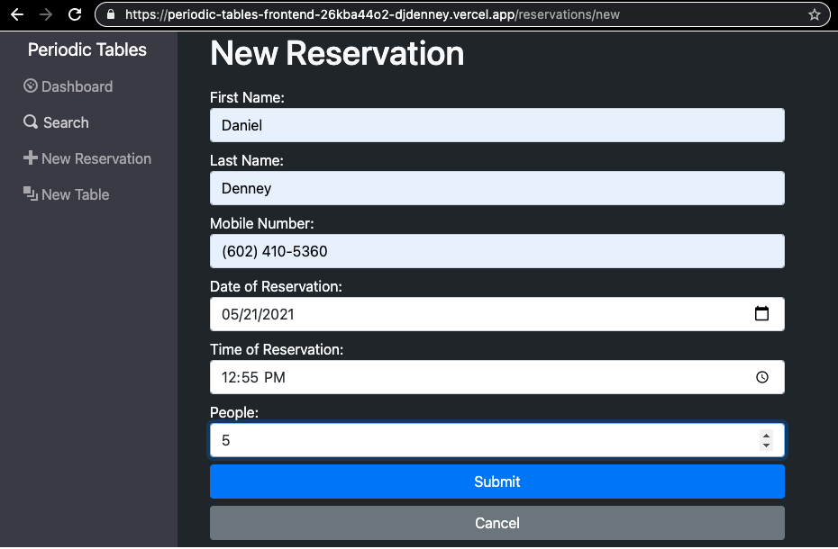

### add new table

1. Select "New Table"

2. Enter requested details into all fields and click "Submit"
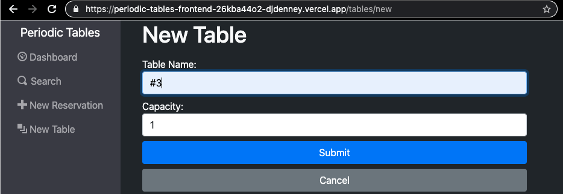

### delete a reservation

1. From "Dashboard" or "Search", click "Cancel" button corresponding to reservation to delete
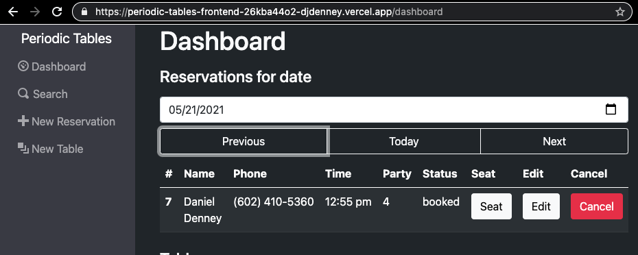
2. Click "Ok" on the confirmation window
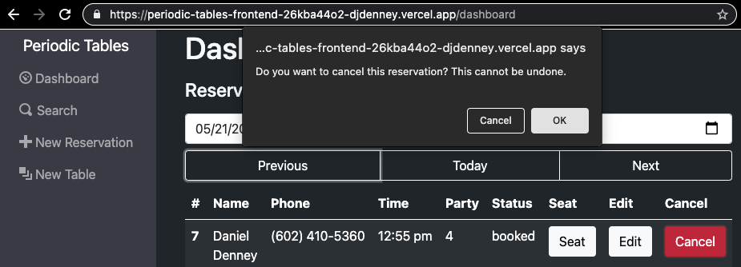

### seat a reservation

1. From "Dashboard" or "Search", click "Seat" button corresponding to the reservation to seat

2. Select a table from the dropdown menu and click the "Submit" button
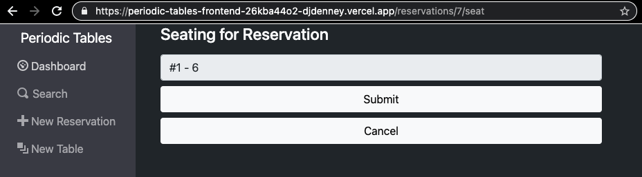

### edit a reservation

1. From "Dashboard" or "Search", click "Edit" button corresponding to the reservation to edit

2. Change details as needed and click the "Submit" button
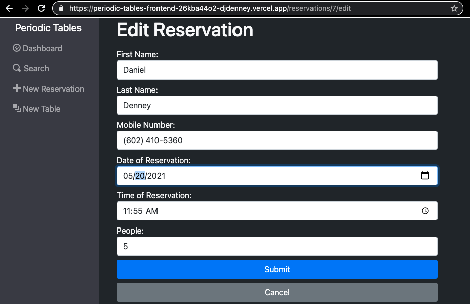

### finish a table

1. From "Dashboard", click "Finish" button corresponding to the table to finish

2. Click "Ok" on the confirmation window
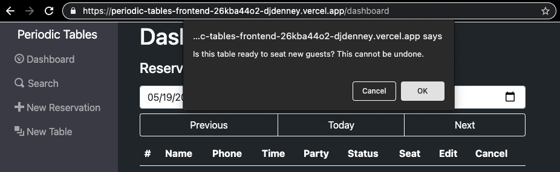

### search for a reservation by date

1. From "Dashboard", enter date into box beneath text "Reservations for date"
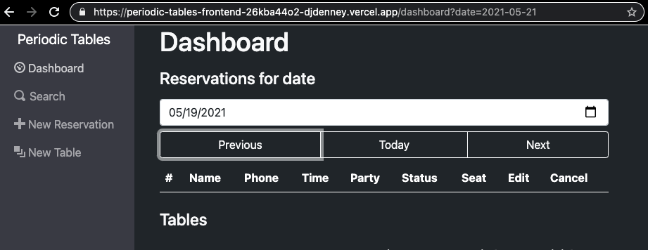
2. Alternatively, navigate to the appropriate date using the "Previous", "Today", and "Next" buttons
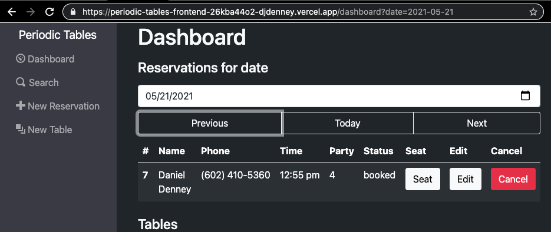

### search for a reservation by phone number

1. From "Dashboard", click "Search"
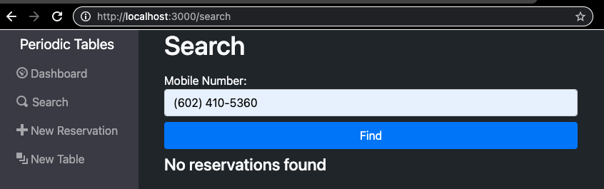
2. Enter phone number or partial phone number into "Mobile Number:" box and click find
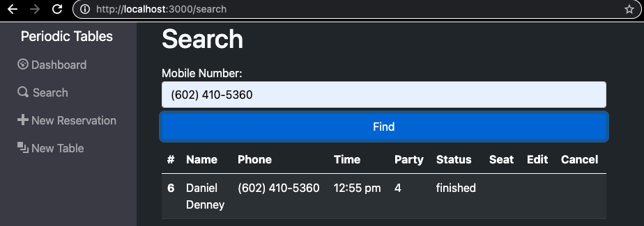

## Built with
    React
    Express
    Node
    PostgreSQL
    Knex
    Bootstrap
    